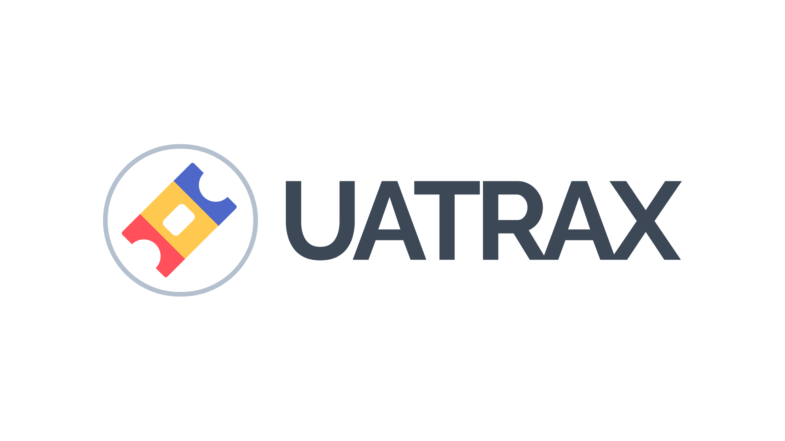

# UA-Trax Project - Capstone Project of the Good Boys
**Managed by Jovell, Andrew, Uzrhein, and Aldwin**  
Final Defense: 📅 *11/13/24*  
Development started: August 08, 2024  
Development ended: November 08, 2024

<p align="center">
  
</p>

---

## 🚀 About UA-Trax

**UA-Trax** is a comprehensive internal system designed to manage the lifecycle of university-owned equipment and facilities. The system facilitates:

* Equipment tracking, lending, and maintenance
* Facility booking and issue reporting
* Role-based access and control for admins, custodians, and users
* Queue-powered ticket and job processing
* Analytics and insights through Laravel Trend and Filament UI

## 🪰 Built With

* [Laravel 11](https://laravel.com)
* [Livewire 3](https://livewire.laravel.com)
* [Filament 3](https://filamentphp.com)
* [Flowframe Trend](https://github.com/flowframe/laravel-trend)
* [PHP 8.2+](https://www.php.net/)
* \[MySQL/PostgreSQL/SQLite]

---

## 🛠️ Setup Instructions

```bash
# 1. Clone the repo
git clone https://github.com/Jovellmiranda/UA-Trax.git
cd UA-Trax

# 2. Install dependencies
composer update

# 3. Setup environment
cp .env.example .env
php artisan key:generate

# 4. Migrate and seed the database
php artisan migrate:fresh --seed

```

> 💡 If you prefer running them separately:

```bash
php artisan serve        # Start the web server
php artisan queue:work   # Run background jobs
```

---

## 🥪 Testing

```bash
php artisan test
```

Or, if you are using PHPUnit directly:

```bash
./vendor/bin/phpunit
```

---
## 🔐 User Roles

UA-Trax uses role-based access control, with the following roles:

* `Equipment Super Admin`
* `Equipment Admin (Lab Custodian)`
* `Equipment Admin (OMISS)`
* `Facility Admin`
* `Facility Super Admin`
* `Regular User`

## Laravel Sponsors

Each role has specific access to tickets, reports, and data views.

---

## 📊 Features

* 📦 Equipment request, return, issue tracking
* 🏢 Facility reservations and reports
* 🗓️ Ticket lifecycle management
* ⏳ Background job queue for ticket processing
* 📊 Admin dashboards and analytics (Filament + Trend)
* 🔒 Authentication and role-based permissions

---

## 🤝 Contributing

Contributions are welcome! Feel free to submit pull requests, file issues, or suggest features.

---

## 🛡 License

This project is open-sourced under the [MIT license](https://opensource.org/licenses/MIT).

---